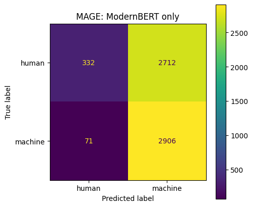
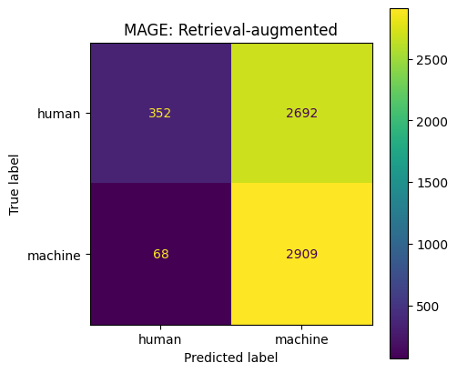

# rag

Retrieval-augmented detection of AI-generated text.

I fine-tuned ModernBERT to tell human writing apart from machine-generated text using the RAID benchmark, then tested how well it holds up on a different benchmark, MAGE. On top of the classifier I added a simple retrieval step: for each test text, look up its nearest labelled neighbours and blend their vote into the prediction.

The short version: the model is excellent on data that looks like its training set, struggles badly on data that doesn't, and retrieval in its current form only helps a little. I think the reasons are the interesting part, so I've written them up below.

<a href="https://colab.research.google.com/github/Mary-Vadi/rag/blob/main/rag_ai_text_detection.ipynb"></a>

## What's in here

```
rag_ai_text_detection.ipynb   the full pipeline, runs top to bottom in Colab
figures/                      confusion matrices from the MAGE evaluation
```

The notebook is self-contained. One of the early cells writes a small `src/` package (config, data loading, modelling, retrieval) into the Colab filesystem, and the rest of the notebook imports from it, so there's nothing else to upload.

## How it works

1. **Data.** I take the first 10% of RAID's training split and a random 10% of MAGE's train and test splits. Texts under 50 characters are dropped, and each set is capped and balanced between human and machine as far as the data allows. Labels are 0 for human and 1 for machine throughout. MAGE uses the opposite convention, so its labels are flipped when loading.
2. **Classifier.** `answerdotai/ModernBERT-base` is fine-tuned for binary classification on RAID, using a stratified 80/10/10 train/validation/test split. The checkpoint with the best validation accuracy is kept.
3. **Retrieval index.** The fine-tuned encoder embeds the MAGE training texts (mean pooling over tokens, L2-normalised, 768 dimensions). The vectors go into an exact FAISS inner-product index, so search is by cosine similarity.
4. **Prediction.** For each MAGE test text I find its 7 nearest neighbours, turn their labels into a similarity-weighted "machine" probability, and mix that with the classifier's own probability:

   ```
   final = 0.7 * classifier + 0.3 * retrieval
   ```

   Anything at 0.5 or above is called machine-generated.

One thing worth being clear about: the retrieval step uses labelled MAGE data, taken from MAGE's train split, which never overlaps its test split. So the retrieval result isn't a zero-shot number. It answers a slightly different question: if you have a pool of labelled examples from a new domain, can you get value out of them at inference time without retraining?

## Data

| Set | Source | Texts |
|---|---|---|
| Train | RAID | 35,540 |
| Validation | RAID | 4,442 |
| Internal test | RAID | 4,443 |
| Retrieval corpus | MAGE train | 19,401 (9,401 human, 10,000 machine) |
| External test | MAGE test | 6,021 (3,044 human, 2,977 machine) |

The RAID sample (44,425 texts) is 19,425 human and 25,000 machine. It isn't fully balanced because human-written texts make up only about 3.5% of the RAID slice I used, so the human side ran out before reaching the cap.

## Results

Single run, seed 42, on a Colab T4. Training took about 52 minutes for two epochs. Precision, recall and F1 treat "machine" as the positive class.

| Evaluation | Accuracy | Precision | Recall | F1 |
|---|---|---|---|---|
| RAID internal test | 98.76 | 99.20 | 98.60 | 98.90 |
| MAGE, classifier only | 53.78 | 51.73 | 97.62 | 67.62 |
| MAGE, with retrieval | 54.16 | 51.94 | 97.72 | 67.82 |

<p align="center">
  
  
</p>

## What the results are saying

**The classifier learned RAID, not AI text in general.** Nearly 99% accuracy on RAID's held-out test set drops to about 54% on MAGE, which is barely better than guessing. The confusion matrices show how it fails. It still catches almost every machine-written MAGE text (2,906 of 2,977), but it also labels 2,712 of the 3,044 human texts as machine. When the writing is unfamiliar, its default answer is "AI".

**Retrieval helped, but only slightly.** It got a net 23 more texts right (20 human, 3 machine), which is about +0.4 points of accuracy. Some of that ceiling is built into the blend. With a weight of 0.7 on the classifier, even if all seven neighbours say "human", a text only flips to human when the classifier's machine probability is below about 0.71. My guess is that the classifier is much more confident than that on most of the human MAGE texts it gets wrong, so retrieval never really gets a say. I haven't looked at the probability distribution yet, so that's the first thing I want to check.

**The embeddings probably carry the same bias.** The retrieval vectors come from the model that was fine-tuned on RAID, so the neighbourhoods it builds on MAGE may be organised around RAID-specific cues rather than anything that transfers.

## Running it

1. Open the notebook in Colab with the badge above and switch the runtime to a GPU. A free T4 is enough.
2. Run the cells from top to bottom. The notebook installs its own dependencies and asks to mount your Google Drive, which is where the outputs are saved.
3. The first run is slow: `load_dataset("liamdugan/raid")` downloads the full RAID CSVs (around 15 GB) even though only 10% is used.

Outputs end up in `/content/drive/MyDrive/modernbert_raid_mage/outputs/`:

- `best_model/`: the fine-tuned model and tokenizer
- `results.csv`: the comparison table above
- `experiment_summary.json`: config, sample counts and all metrics

### Settings

Everything is in the `Config` dataclass. The easiest way to change something is to override it straight after `cfg = Config()` in step 5, for example `cfg.rag_alpha = 0.5`.

| Setting | Default | What it controls |
|---|---|---|
| `max_raid_examples` | 50,000 | Cap on the RAID sample. `None` uses the whole 10% slice. |
| `max_mage_retrieval_examples` | 20,000 | Cap on the retrieval corpus. |
| `max_mage_test_examples` | 10,000 | Cap on the MAGE test set. |
| `num_train_epochs` | 2 | Training epochs. |
| `learning_rate` | 2e-5 | Learning rate. |
| `max_length` | 512 | Tokens per text. Longer texts are truncated. |
| `retrieval_k` | 7 | Neighbours per query. |
| `rag_alpha` | 0.7 | Weight on the classifier in the final blend. |

The effective batch size is 16 (8 per device with 2 gradient accumulation steps), with fp16 when a GPU is available.

## What I want to try next

- Tune the blend weight and the decision threshold on a held-out slice of MAGE instead of fixing them at 0.7 and 0.5.
- Look at the classifier's probabilities and calibrate them, for example with temperature scaling, so retrieval has room to matter.
- Build the index with a general-purpose sentence encoder instead of the RAID-tuned model.
- Give closer neighbours more weight. The current weighting uses raw cosine similarities, which tend to be close together, so in practice it behaves almost like a plain majority vote.
- Sample RAID randomly rather than taking the first 10%, remove the caps, and also evaluate on MAGE's two out-of-distribution test files.
- Move the `src/` modules out of the notebook into proper files so they can be reused and tested.

## Datasets and model

- **RAID**: Dugan et al., *RAID: A Shared Benchmark for Robust Evaluation of Machine-Generated Text Detectors*, ACL 2024. [liamdugan/raid](https://huggingface.co/datasets/liamdugan/raid)
- **MAGE**: Li et al., *MAGE: Machine-generated Text Detection in the Wild*, ACL 2024. [yaful/MAGE](https://huggingface.co/datasets/yaful/MAGE)
- **ModernBERT**: Warner et al., 2024. [answerdotai/ModernBERT-base](https://huggingface.co/answerdotai/ModernBERT-base)
- **FAISS** for nearest-neighbour search. [facebookresearch/faiss](https://github.com/facebookresearch/faiss)

Please check each dataset's licence before reusing it.

## About

I'm Maryam Vadikheil, an MSc Computer Science student at the University of Salford, working on AI-generated text detection. If you have questions or ideas, feel free to open an issue or reach out on [LinkedIn](https://www.linkedin.com/in/maryam-vadikheil).
